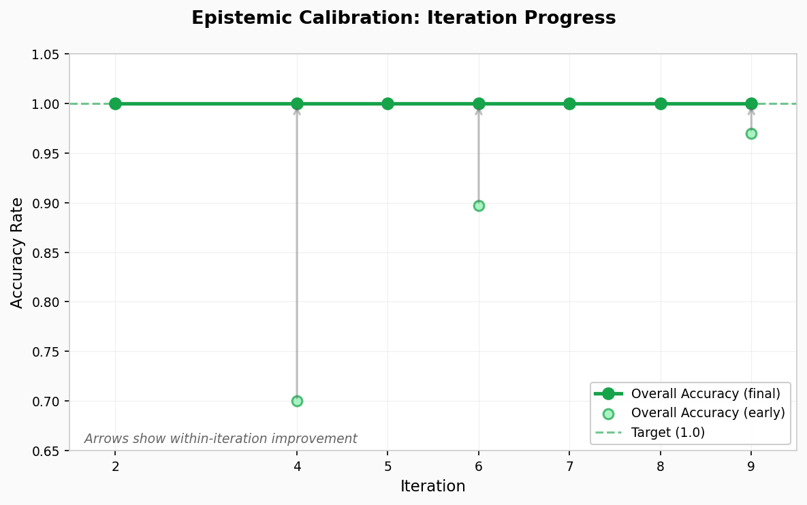
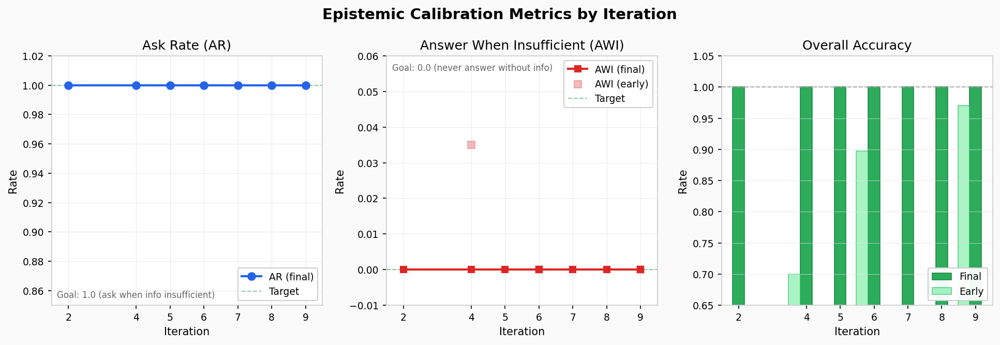

# Epistemic Calibration Metrics

This repository publishes high-level, iteration-level metrics tracking a narrow evaluation goal for instruction-following language models: **responding appropriately when prompts do not contain enough information to answer safely.**

The focus here is measurement and outcomes. This repository is intentionally limited to aggregate results.

---

## Scope

### Included
- Iteration-level summary metrics (aggregate, non-identifying)
- Plots showing metric trends over time
- Plain definitions of the reported metrics

### Not included
- Prompts, datasets, or item-level examples
- Any implementation details for how behaviours are induced
- Model weights or training code

---

## Metrics

| Metric | Definition | Target |
|--------|------------|--------|
| **AR** (Ask Rate) | Proportion of "insufficient information" items where the model asks a clarifying question | → 1.0 |
| **AWI** (Answer When Insufficient) | Proportion of "insufficient information" items where the model answers anyway | → 0.0 |
| **AWS** (Ask When Sufficient) | Proportion of "sufficient information" items where the model asks anyway | → 0.0 |

**Goal:** Reduce AWI while keeping AWS low, and maintaining or improving AR.

---

## Results

### Current Status (Iteration 9)

| Metric | Value |
|--------|-------|
| AR | 1.00 |
| AWI | 0.00 |
| AWS | 0.00 |
| Overall Accuracy | 1.00 |

### Progress Over Iterations

Detailed metrics breakdown

### Data

Summary data: [`data/iter_summary.csv`](data/iter_summary.csv)

---

## Notes

- Results are reported as aggregate telemetry only
- `phase` column indicates early (initial) vs final (converged) runs within each iteration
- Iterations 1 and 3 were internal-only development cycles
- Deeper technical detail can be shared privately under appropriate boundaries

---

## Contact

For inquiries about this work, including collaboration or technical details under NDA, please reach out via the contact information on my profile.
